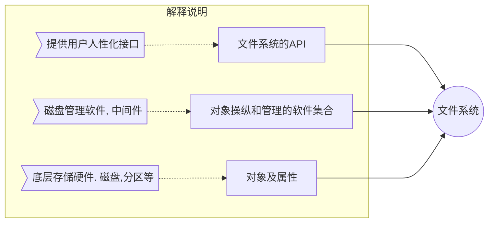
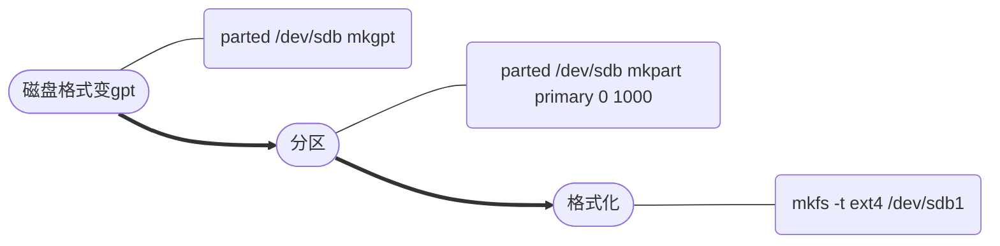

# 存储、系统
>说明：
文件系统： 存储设备或分区上的方法和数据结构；
>>方法：存放和取出数据的策略。
数据结构：划分存储空间大小和存放大小的策略。

>openEuler默认文件系统为 ext4



|      文件系统类型      |                           使用场景                           |
| --------------------- | ------------------------------------------------------------ |
| FAT                   | win9X使用的文件系统，FAT16,FAT32                              |
| NTFS                  | 基于安全性的系统文件，win NT采用;win200 采用新版NTFS 5.0       |
| NFS [network file ..] | 网络文件系统，unix网络文件共享                                 |
| RAW                   | 未经处理或为格式化                                            |
| Ext                   | gnu/linux标准文件系统,存取性能好;ext2,ext3,ext4               |
| XFS                   | 高性能日志文件系统; 处理大文件; IRIX系统开发，后移植到linux内核 |
| vfat                  | linux 对 dos,win系统下FAT统称                                 |
| iso 9660              | 光盘标准文件系统 iso                                          |


## 磁盘


### 磁盘类型

硬盘材质：
HDD    机械硬盘
SSD    固态硬盘[^固态硬盘]    特点：读取速度快，寿命短

磁盘接口说明：
>两大类型：并行、和串行(目前主流)
ATA:  并行IDE    串行SATA
SCSI:    并行SCSI    串行SAS
NL-SAS(近线sas)： 结合SATA的容量和SAS的协议
FC:    使用SCSI协议

|                         磁盘接口类型                          |                                                             说明                                                              |
| ------------------------------------------------------------ | ----------------------------------------------------------------------------------------------------------------------------- |
| IDE(Intergrated Device Electronics:电子集成驱动器)            | 最初的通用标准，任何电子集成驱动器都属于IDE(包括SCSI)                                                                            |
| SATA(Serial-ATA:串行ATA)                                     | IDE属于Parallel-ATA(并行ATA)。IDE称为并口，SATA成为串口;此两种为个人电脑和低端服务器常用硬盘                                       |
| SCSI(Small Computer System Interface: 小型计算机系统专用接口) | SAS(Serial Attached SCSI)是串口的SCSI接口。一般服务器硬盘采用此两类接口;性能、稳定性比上述两种高，支持热拔插。价格高、容量小、噪音大 |
| FC(FibreChannel)                                             | 光纤通道直接作为连接接口，用于高端存储产品                                                                                       |


[^固态硬盘]:(不使用磁技术存储数据；利用FLASH芯片和DRAM芯片作为数据云存储的硬盘)


### 磁盘信息 

#### 查看信息

##### fdisk -l 所有磁盘信息——挂载、未挂载磁盘

##### df -h   系统挂载、磁盘空间大小和利用率


#### 磁盘分区类型
MBR方案(Mastar Boot Record)：
>一个扇区512字节。存放两个东西[MBR(安装开机管理程序) 446字节、 分区表 64字节(记录四个分区信息)]
>历史原因：
硬盘分区一般为 三个主分区加上一个扩展分区
硬盘容量 = 主分区+扩展分区；扩展分区容量 = 各个逻辑分区容量和

若分区大小不够用时，扩展分区作为位置信息纪录逻辑分区的位置。  
逻辑分区不存在MBR扇区中。


#### 磁盘分区命名规则
>说明：
linux 无盘符概念，通过设备名访问
设备名存放在 /dev 目录中
* /dev/xxyN
1. xx    设备类型(通常(不绝对)：hd-IDE磁盘，sd-SCSI，fd-软驱，vd-virtio磁盘)
2. y    分区所在物理设备(a,b,c表示)
3. N    分区(前4个分区为数字1~4，逻辑分区从5开始)

>例子： 
/dev/sdb6  —— 第二个SCSI硬盘上，第二个逻辑分区
/dev/hda3 —— 第一个IDE磁盘上，第三个主分区或扩展分区


#### 磁盘分区方案

##### MBR分区方案
1. 主启动记录：驱动器开始部分的一个特殊的启动扇区，指定如何对磁盘分区。
2. 64字节限制分区表；SCSI最多: 15个分区(扩展分区不能直接使用，未算在内)，主分区4个，逻辑分区12个。IDE最多：63个分区(扩展分区未算在内)，主分区4个，逻辑分区60个。
3. 该方案最大磁盘和分区大小限制：2TB。
    * 原因： 分区数据以32位值存储
    * 2^32^(32位) x 512(一个扇区大小) = 2TB


##### GPT分区方案
>提出原因：
MBR分区方案的大小限制不再是理论上的限制。
>>GPT含义：
意为GUID分区表。每个分区有全局唯一的标识符(globally unique identifier, GUID)。

* 分区说明
1. 无主、逻辑分区之分。
2. 每个硬盘最多：    
    1. 128个分区
    2. 18EB分区大小
    2. 逻辑块地址分配 64位
    
* 具体原理：
1. 采用LBA(Logical Block Address)定义扇区
2. 第一个LBA为 LBA0
3. 分区表34个 --- 使用34个LBA区块记录分区信息 
4. 优化：
    1. 磁盘前34个LBA使用  磁盘后33个LBA备份
    
LBA说明：
* LBA0 —— MBR相容区块(Protective LBA)
    * 用来兼容MBR
    * GPT表头记录 —— 记录分区表位置和大小
* LBA1-LBA33  —— 记录实际分区信息
* LBA-1-LBA-33  —— 备份对应分区信息
* 每个LBA记录四个分区表  —— 4*33 = 128 个分区


### 磁盘分区操作

#### fdisk
>传统linux硬盘分区工具  —— MBR分区方案。
不支持大于 2TB 分区
>>语法：fdisk (选项)(参数) 

##### 选项操作
1. -b <分区大小>    指定分区大小
2. -l    外围设备分区表情况
3. -s <分区编号>    输出分区大小，单位为区块(MB)
4. -u 搭配 -l     用分区数 取代 柱面数，表示分区起始地址。
5. -v    版本信息


##### 交互式分区操作
>选择指定硬盘
>>例如：fdisk /dev/sdb
交互式命令参数

| 命令    |说明     |
| --- | --- |
|   a  |设置可引导标记     |
|   b  |编辑 bsd 磁盘标签     |
|   c  |设置 DOS 操作系统兼容标记     |
|    d |删除分区     |
|    l |显示文件系统类型。82 - linux swap 分区，83 - linux 分区     |
|    m |帮助菜单     |
|    n |新建分区     |
|    o |建立空白 DOS 分区表     |
|  p   |打印分区表     |
|  q   | 不保存退出     |
|  s  |新建空白 SUN 磁盘标签     |
|  t   | 改变分区系统ID    |
|  u   | 改变显示记录     |
|  v   |   验证分区表  |
|  w   |保存退出     |


#### parted
>说明：
支持2T以上磁盘分区

>>语法:
parted [options] [device] [command[options]]

##### 选项操作
1. -h    帮助信息
2. -i    交互模式
3. -s    脚本模式(非交互模式)
4. -v    版本信息
5. device    磁盘设备名称，如/dev/sda
6. command    parted指令。【无指令则进入交互模式】


##### 交互式分区操作
>说明：
选择硬盘进入交互模式
>>例如：parted /dev/sdb

|     命令     |                               说明                               |
| ----------- | ---------------------------------------------------------------- |
| align-check | 检查分区N的类型(min\|opt)是否对齐                                  |
| mklabel     | 创建新的分区表(磁盘标签);example： ```mklable gpt``` 创建gpt分区表 |
| name        | 给分区命名                                                        |
| print       | 打印分区表                                                        |
| rescue      | 修复丢失分区                                                      |
| resizepart  | 调整分区大小                                                      |
| rm          | 删除分区                                                         |
| select      | 选择要编辑的设备 //默认只对指定设备操作，此命令可改变指定设备        |
| disk_set    | 更改选定设备上的标志                                              |
| disk_toggle | 切换设备的标志状态                                                |
| quit        | 退出                                                             |
| set         | 更改分区标记                                                      |
| toggle      | 设置或取消分区标记                                                |
| unit        | 设置默认单位                                                      |
| version     | 版本信息                                                         |

##### 非交互式分区操作



### 格式化与挂载

#### 格式化
>格式化流程
1. 查看支持的文件类型
    * ```mkfs.```  按 tab 补全，可查看支持的文件类型  
2. 磁盘格式化
    * ```mkfs.ext4 /dev/sdb2```  格式化根下的sdb2分区，格式为.ext4
3. 信息确认
    * ```ll /dev/sdb2```  查看磁盘信息
    

##### 格式化命令 mkfs  
>make filesystem
>>语法： 
mkfs [options] device [blocks]
1. device    硬盘分区；例：/dev/sda
2. -V    详细显示
3. -t    给定档案系统型式，预设值为ext2
4. -c    制作档案系统前，检查partition 是否有坏轨
5. -l bad_blocks_file    将坏轨的block资料 加到bad_blocks_file 
6. block    给定block大小


#### 挂载
>说明：
格式化后不能直接使用磁盘，需进行挂载
>>原因：
* linux中，一切皆文件，使用磁盘需建立联系(目录文件),建立过程叫做挂载
* 访问设备文件时，该目录相当一个接口。

##### 挂载流程
1. 挂载目录
    * media 和 mnt。也可自己指定挂载点目录。
2. 临时挂载
    * mount /dev/sda5 /test     --- 挂载到test目录
3. 永久挂载
    * vim 编辑 /etc/fstab

###### /etc/fstab
>文件作用：
系统启动时，自动读取该文件信息，并挂载指定的文件系统。

>>fstab文件格式
<file system\> <dir\> <type\> <option\> <dump\> <pass\>
 

 | file system    |dir     |type     |option     |dump     |pass     |
 | --- | --- | --- | --- | --- | --- |
 |/dev/sda1     | /     |ext4     |defaults,noatime     |0     |1     |
 |分区位置     | 挂载点目录     |文件系统类型     |     |linux 自带备份工具 参数:0不备份/1备份     |fsck(file sys check) 参数：0 不检测 1 最高优先级检测 2 次级优先检测     |

option参数列表：
| 参数    |功能     |
| --- | --- |
|auto     |启动或键入命令 mount -a 时，自动挂载     |
|ro     |只读挂载|
|rw     |读写挂载     |
|user     |允许任意用户挂载     |
|nouser     |只能root挂载     |
|dev/nodev     |解析/不解析 文件系统上的快特殊设备     |
|noatime/nodiratime     |不更新文件系统/目录上 inode 访问记录，可提升性能     |
|defaults     |使用文件系统的默认挂载参数     |
|sync/async     |I/O 同步/异步 进行     |
|suid/nosuid     |允许/不允许suid 操作和设定 sgid位。常用于特殊任务，使一般用户运行程序时临时提升权限     |


### 逻辑卷
>LVM(Logical Volume Management)-逻辑卷管理：
磁盘分区管理的机制，建立硬盘分区上、文件系统之下的逻辑层。
>>作用：
磁盘分区管理机制，提高管理灵活性。

* 物理单元(PE)
    * Physical Extents
    * 物理寻址最小单元，可指定，默认4MB。一旦确定无法改变，同组卷所有的物理卷PE大小一致。
* 逻辑单元(LE)
    * Logical Extents
    * 逻辑卷中可分配的最小单元，通常LE的大小和PE相同。
    * 逻辑区域大小取决于逻辑卷所在物理区域的大小。
* 物理卷
    * Physical Volume
    * 逻辑出来的概念，非真实硬件(如:sda1,sda2,sdb 等)
* 卷组(VG)
    * Volume Group
    * 由PV组成(将多个PV分区整合起来)
* 逻辑卷(LV)
    * Logical Volume
    * 建立在VG上，平行切割VG卷，同时使用多个PV(包含在VG中的，可跨硬件)
    * 大小可伸缩(避免容量满的时候，新建分区转移数据的繁复操作)
        * ext2 ext3 ext4 可增减容
        * xfs 只能增容、不可兼容

* LV的优点
1. 灵活的容量、在线的数据再分配
2. 可伸缩的存储池(在VG中自由的增减PV)
3. 自定义设备名
4. 磁盘条带化
    * 生成逻辑盘，存储在两个或多个磁盘上
    * 提升数据吞吐量
5. 卷镜像和卷快照
    * 设备快照
    * 创建一次性备份

#### 管理命令

##### pv  物理卷
>pvcreate
用于创建物理卷pv

>>语法
pvcreate [选项] 设备文件名

>>例子
pv /dev/sda{1,2,3}

###### 选项
1. -f    非交互,强制
2. -u    指定设备uuid
3. -y    回答yes
<font color=red>注:使用分区创建时，需将id改成8e，才能创建物理卷。用fdisk修改id</font>

* 查看物理卷信息
1. pvdisplay
2. pvscan
3. pvs


##### vg  卷组
>vgcreate 创建LVM卷组
>>语法：
vgcreate [选项] 卷组名 物理卷列表

>>例子：
vgcreate vg1000 /dev/sdb1 /dev/sdb2

###### 选项
1. -l    最大逻辑卷数
2. -p    最大物理卷数
3. -s    物理卷的PE大小

*　查询卷组信息
1. vgdisplay
2. vgscan


##### lv  逻辑卷
>lvcreate 用于创建LVM

>>语法：
lvcreate [选项] 逻辑卷名称

>>例子：
lvcreate -L 200M vg200 
指定 lv 名创建：
lvcreate -L 200M -n lv名 vg名

###### 选项
1. -L    逻辑卷大小
    * 单位: 'kKmMgGtT' 字节
2. -l    逻辑卷大小(指定LE数)
3. -n    指定lv名

<font color=red>注：逻辑卷创建完成后，需要格式化，挂载后使用。 mkfs格式化，mount挂载</font>

* 查询卷组信息
1. lvdisplay
2. lvscan


#### 动态调整

##### 扩容流程
> 特点：
无需卸载，在线扩容
1. 查看是否足够vg空间：vgs
2. 命令扩容：lvextent -L +SIZE lv_device
3. 同步文件系统容量信息到内核: resize2fs [device ] lv_device


##### 缩容流程
>注意：
缩容有风险
1. 确认目标逻辑卷大小有足够空间
2. 卸载文件系统   umount;强制检测 e2fsck -f
3. 同步文件系统容量信息到内核    resize2fs device
4. 将lv状态设为不活动    lvchange -a n device
4. 缩减逻辑卷 lvreduce -L 指定容量 
5. 重新挂载使用

##### 命令详解

###### lvresize
>作用：
调整逻辑卷空间大小。包含lvextend(增容)、lvreduce(减容)的功能。

>>语法：
lvresize [选项] 逻辑卷名称

>>例子：
增容 lvresize -L +200M /dev/vg1000/lovol0

* 选项：
    * -L    指定大小  'kKmMgGtT' 字节
    * -l    指定大小 (LE数)


## 系统分区说明

### 系统交换空间 swap
>作用： 内存中转站
* 情况1：物理内存资源紧张时 
* 操作：将不常访问资源保存至预设硬盘的交换空间，并释放该内存
* 情况2：需要访问sawp内容时
* 操作：加载到内存中
* 应用：系统(如ubuntu)休眠依赖swap分区

#### swap分区配置
* 创建swap分区
    1. fdisk    创建分区
    2. mksswap    创建swap分区
    3. swapon    启用swap分区
    
* 创建swap文件
    1. 创建文件
    2. mkswap    格式化文件
    3. swapon    启用swap文件
    
推荐swap大小配置
* RAM大小    推荐交换空间
* < 2GB    两倍于
* 2 - 8GB    等于
* > 8GB    8GB


