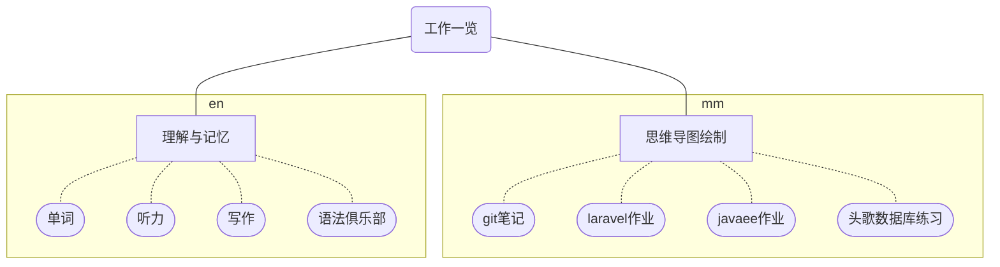

# 日常工作一览

|     时间     |       星期一       |       星期二       |       星期三       |       星期四       |       星期五       |        星期六        |       星期日        |
| ----------- | ----------------- | ----------------- | ----------------- | ----------------- | ----------------- | ------------------- | ------------------ |
| 07:00-07:30 | 起床、洗漱          | 起床、洗漱         | 起床、洗漱         | 起床、洗漱         | 起床、洗漱          | 起床、洗漱           | 起床、洗漱          |
| 07:30-08:00 | 早餐              | 早餐               | 早餐               | 早餐               | 早餐              | 早餐                 | 早餐                |
| 08:00-09:00 | 英语学习           | 英语学习           | 英语学习           | 英语学习           | 英语学习           | 英语学习             | 日语学习            |
| 09:00-10:30 | 408考研科目        | 408考研科目        | 408考研科目        | 408考研科目        | 408考研科目        | 408考研科目          | 408考研科目         |
| 10:30-10:45 | 休息（运动/伸展）   | 休息（运动/伸展）   | 休息（运动/伸展）   | 休息（运动/伸展）   | 休息（运动/伸展）   | 休息（运动/伸展）     | 休息（运动/伸展）    |
| 10:45-12:15 | 微积分             | 线性代数           | 概率论             | 微积分             | 线性代数           | 概率论               | 数学（自由选择）     |
| 12:15-13:15 | 午餐及短暂休息      | 午餐及短暂休息      | 午餐及短暂休息      | 午餐及短暂休息      | 午餐及短暂休息      | 午餐及短暂休息        | 午餐及短暂休息       |
| 13:15-14:45 | 算法学习           | 算法学习           | 算法学习           | 算法学习           | 算法学习           | 算法学习             | 自由安排（兴趣爱好） |
| 14:45-15:00 | 休息（运动/伸展）   | 休息（运动/伸展）   | 休息（运动/伸展）   | 休息（运动/伸展）   | 休息（运动/伸展）   | 休息（运动/伸展）     | 休息（运动/伸展）    |
| 15:00-16:30 | 数据结构           | 数据结构           | 数据结构           | 数据结构           | 操作系统           | 计算机网络           | 自由安排（兴趣爱好） |
| 16:30-17:00 | 休息/短视频放松     | 休息/短视频放松     | 休息/短视频放松     | 休息/短视频放松     | 休息/短视频放松     | 休息/短视频放松       | 休息/短视频放松      |
| 17:00-18:00 | 嵌入式开发          | Python全栈         | 嵌入式开发         | Python全栈         | 嵌入式开发          | 自由时间（物理学等）  | 周总结与下周规划     |
| 18:00-19:00 | 晚餐及短暂休息      | 晚餐及短暂休息      | 晚餐及短暂休息      | 晚餐及短暂休息      | 晚餐及短暂休息      | 晚餐及短暂休息        | 晚餐及短暂休息       |
| 19:00-20:30 | 考研政治           | 考研政治           | 考研政治           | 考研政治           | 考研政治           | 自由时间（休闲/复习） | 周总结与下周规划     |
| 20:30-21:00 | 休息（短视频/运动） | 休息（短视频/运动） | 休息（短视频/运动） | 休息（短视频/运动） | 休息（短视频/运动） | 自由时间（休闲/复习） | 早睡准备，充足休息   |
| 21:00-22:30 | Linux开发         | GO语言项目         | Linux开发          | GO语言项目         | 就业相关复习        | 自由时间（休闲/复习） | 早睡准备，充足休息   |
| 22:30-23:00 | 日语或Wolfram      | 日语或Wolfram      | 日语或Wolfram      | 日语或Wolfram      | 日语或Wolfram      | 自由时间（休闲/复习） | 早睡准备，充足休息   |
| 23:00-23:30 | 洗漱、整理思绪      | 洗漱、整理思绪      | 洗漱、整理思绪      | 洗漱、整理思绪      | 洗漱、整理思绪      | 洗漱、整理思绪        | 洗漱、整理思绪       |
| 23:30-07:00 | 睡眠              | 睡眠               | 睡眠               | 睡眠               | 睡眠              | 睡眠                 | 睡眠                |