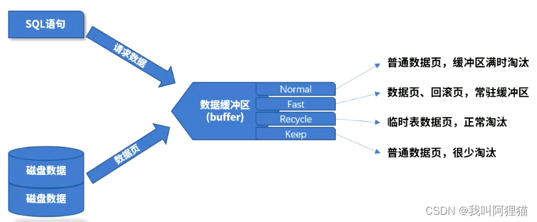

# 参数类型


>对应到Oracle的Scope
both：既修改内存中的值，也修改配置文件中的值，重启不重启都一样生效
spfile：只修改配置文件中的值，重启数据库生效
memory：只修改内存中的值，重启数据库后恢复设置前的样子

>达梦根据参数类型可分为，静态参数和动态参数两种，这两种均支持通过系统函数、SQL命令进行修改
静态参数：只能修改配置文件中的值，对内存中的值不进行修改，所以静态参数修改后使其生效的话，需要对数据库进行重启
动态参数：既能修改内存中的值，也能修改配置文件中的值，所以动态参数修改后是立即生效的

## 3.1.1 READ ONLY
只读参数，不能通过系统函数、SQL命令达到修改参数的目的，只能从dm.ini配置文件中进行修改

## 3.1.2 SYS
静态参数，可以通过系统函数、SQL命令达到修改参数的目的

## 3.1.3 IN FILE
动态参数（系统级），可以通过系统函数、SQL命令达到修改参数的目的

## 3.1.4 SESSION
动态参数（会话级），可以通过系统函数、SQL命令达到修改参数的目的，可针对某个会话进行修改，便于调试（不然要应用到整个线上系统，一旦出错，影响面就广了）


# 参数修改方式
## 使用dm.ini修改
```shell
# 直接编辑文件修改即可
vim /dm8/data/服务名称 dm.ini
```

## 使用图形化修改
```shell
cd /dm8/tool
./console
```

## SQL语句修改
```sql
# 后面跟的是参数范围
alter system set '参数名'='参数值' both | spfile | memory;
```

### 例子
```sql
# 查询兼容参数类型
select name,value,sys_value,file_value,type,description from v$parameter where name = 'COMPATIBLE_MODE';
# 修改兼容参数类型
alter system set 'COMPATIBLE_MODE'=2 spfile;
```


>修改UNDO_RETENTION


> 修改LIST_TABLE


### 系统函数修改

#### 查看可以使用的系统函数
```sql
select name,id from v$ifun t where name like '%SP_SET%_PARA%';
```


#### 查看系统函数的参数类型
```sql
select * from v$ifun_arg t where id=584;
```


#### 例子
>修改double类型的参数值，UNDO_RETENTION参数



>考试的时候可能会让你修改数据缓冲区大小，没有特殊指明的话就是修改Normal缓冲区的大小，参数对应的是BUFFER

>Normal对应参数BUFFER、Fast对应参数为FAST_POOL_PAGES、Recycle对应参数为RECYCLE、Keep对应参数为KEEP

```sql
alter system set 'BUFFER'=2000 spfile;
```