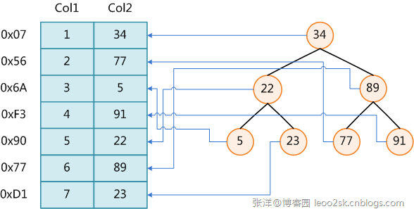

# 索引概念
## 一.建立索引的准则
### 1.1在表中插入数据后创建索引
一般情况下，在插入或装载了数据后，为表创建索引会更加有效率。如果在装载数据之前创建了一个或多个索引，那么在插入每行时DM数据库都必须更改和维护每个索引，使得插入效率降低。

### 1.2怎样创建正确的索引
（1）如果需要经常地检索大表中的少量的行，就为查询键创建索引；
（2）为了改善多个表的连接的性能，可为连接列创建索引；
（3）主键和唯一键自动具有索引，在外键上很多情况下也创建索引；
（4）小表不需要索引；
（5）列中的值相对比较唯一 ；
（6）取值范围大，适合建立索引；
（7）CLOB和TEXT只能建立全文索引、BLOB不能建立任何索引。

### 1.3为性能而安排索引列
在 CREATE INDEX 语句中列的排序会影响查询的性能。通常，将最常用的列放在最前面。如果查询中有多个字段组合定位，则不应为每个字段单独创建索引，而应该创建一个组合索引。当两个或多个字段都是等值查询时，组合索引中各个列的前后关系是无关紧要的。但是如果是非等值查询时，要想有效利用组合索引，则应该按等值字段在前，非等值字段在 后的原则创建组合索引，查询时只能利用一个非等值的字段。

### 1.4限制每个表的索引的数量
一个表可以有任意数量的索引。但是，索引越多，修改表数据的开销就越大。当插入或删除行时，表上的所有索引也要被更改；更改一个列时，包含该列的所有索引也要被更改。因此，在从表中检索数据的速度和更新表的速度之间有一个折衷。例如，如果一个表主要仅用于读，则索引多就有好处；如果一个表经常被更新，则索引不宜多建。

## 二、索引原理
数据库索引，是数据库管理系统中一个排序的数据结构，以协助快速查询、更新数据库表中数据。索引的实现通常使用B树及其变种B+树。

在数据之外，数据库系统还维护着满足特定查找算法的数据结构，这些数据结构以某种方式引用（指向）数据，这样就可以在这些数据结构上实现高级查找算法。这种数据结构，就是索引。
为表设置索引要付出代价的：一是增加了数据库的存储空间，二是在插入和修改数据时要花费较多的时间(因为索引也要随之变动)。

上图展示了一种可能的索引方式。左边是数据表，一共有两列七条记录，最左边的是数据记录的物理地址（注意逻辑上相邻的记录在磁盘上也并不是一定物理相邻的）。为了加快Col2的查找，可以维护一个右边所示的二叉查找树，每个节点分别包含索引键值和一个指向对应数据记录物理地址的指针，这样就可以运用二叉查找在O(log2n)的复杂度内获取到相应数据。

1）B树

B树中每个节点包含了键值和键值对于的数据对象存放地址指针，所以成功搜索一个对象可以不用到达树的叶节点。

成功搜索包括节点内搜索和沿某一路径的搜索，成功搜索时间取决于关键码所在的层次以及节点内关键码的数量。

在B树中查找给定关键字的方法是：首先把根结点取来，在根结点所包含的关键字K1,…,kj查找给定的关键字（可用顺序查找或二分查找法），若找到等于给定值的关键字，则查找成功；否则，一定可以确定要查的关键字在某个Ki或Ki+1之间，于是取Pi所指的下一层索引节点块继续查找，直到找到，或指针Pi为空时查找失败。

2）B+树
B+树非叶节点中存放的关键码并不指示数据对象的地址指针，非也节点只是索引部分。所有的叶节点在同一层上，包含了全部关键码和相应数据对象的存放地址指针，且叶节点按关键码从小到大顺序链接。如果实际数据对象按加入的顺序存储而不是按关键码次数存储的话，叶节点的索引必须是稠密索引，若实际数据存储按关键码次序存放的话，叶节点索引时稀疏索引。

B+树有2个头指针，一个是树的根节点，一个是最小关键码的叶节点。

所以 B+树有两种搜索方法：

一种是按叶节点自己拉起的链表顺序搜索。

一种是从根节点开始搜索，和B树类似，不过如果非叶节点的关键码等于给定值，搜索并不停止，而是继续沿右指针，一直查到叶节点上的关键码。所以无论搜索是否成功，都将走完树的所有层。

B+ 树中，数据对象的插入和删除仅在叶节点上进行。

这两种处理索引的数据结构的不同之处：
a，B树中同一键值不会出现多次，并且它有可能出现在叶结点，也有可能出现在非叶结点中。而B+树的键一定会出现在叶结点中，并且有可能在非叶结点中也有可能重复出现，以维持B+树的平衡。
b，因为B树键位置不定，且在整个树结构中只出现一次，虽然可以节省存储空间，但使得在插入、删除操作复杂度明显增加。B+树相比来说是一种较好的折中。
c，B树的查询效率与键在树中的位置有关，最大时间复杂度与B+树相同(在叶结点的时候)，最小时间复杂度为1(在根结点的时候)。而B+树的时候复杂度对某建成的树是固定的。

## 三、索引类型
根据数据库的功能，可以在数据库设计器中创建三种索引：唯一索引、主键索引和聚集索引。

### 唯一索引 
唯一索引是不允许其中任何两行具有相同索引值的索引。

当现有数据中存在重复的键值时，大多数数据库不允许将新创建的唯一索引与表一起保存。数据库还可能防止添加将在表中创建重复键值的新数据。例如，如果在employee表中职员的姓(lname)上创建了唯一索引，则任何两个员工都不能同姓。
### 主键索引
数据库表经常有一列或列组合，其值唯一标识表中的每一行。该列称为表的主键。
在数据库关系图中为表定义主键将自动创建主键索引，主键索引是唯一索引的特定类型。该索引要求主键中的每个值都唯一。当在查询中使用主键索引时，它还允许对数据的快速访问。
### 聚集索引
在聚集索引中，表中行的物理顺序与键值的逻辑（索引）顺序相同。一个表只能包含一个聚集索引。
如果某索引不是聚集索引，则表中行的物理顺序与键值的逻辑顺序不匹配。与非聚集索引相比，聚集索引通常提供更快的数据访问速度。

